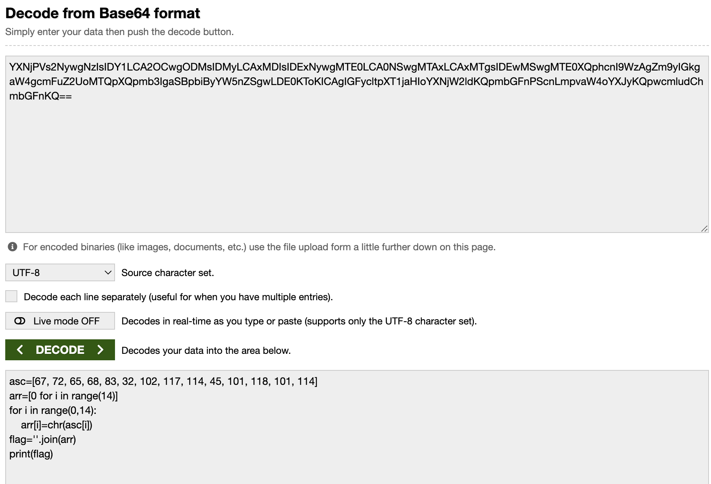
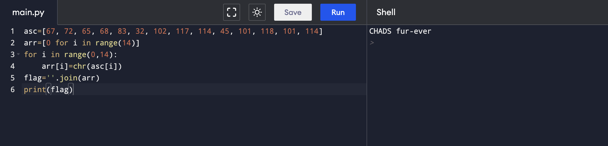

# Encoding and Decoding
Encoding and decoding are essential components of cybersecurity strategies, providing confidentiality, integrity, and authenticity(CIA) to sensitive information and communications.

Encoding and decoding play crucial roles in cybersecurity for several reasons:
1. Data Protection
2. Privacy Preservation
3. Prevention of Unauthorized Access
4. Secure Communication
5. Protection Against Data Tampering
6. Compliance Requirements
7. Authentication

# Your challenge!
Chloe's Spoingus has just stolen the VERY SECRET and GUARDED index.html from our competitors, the macewan cybersecurity club. The only problem is that Spoingus speaks in a encrypted language, can you decipher what it means?

# Solution:
This is a challenge solved on March 8th during our weekly hacking hangout. First, the solvers have to open the developer mode and find the hidden code. 

Then they have to decode the base64 message

When they run the python code, they will see the hidden message. 
